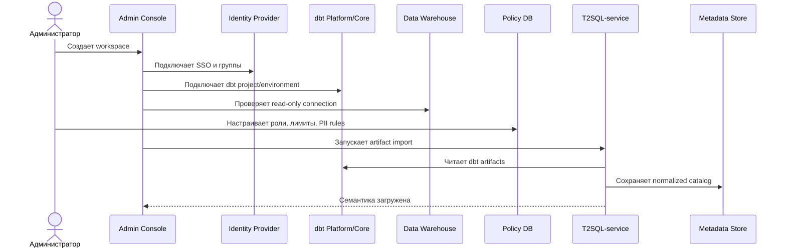
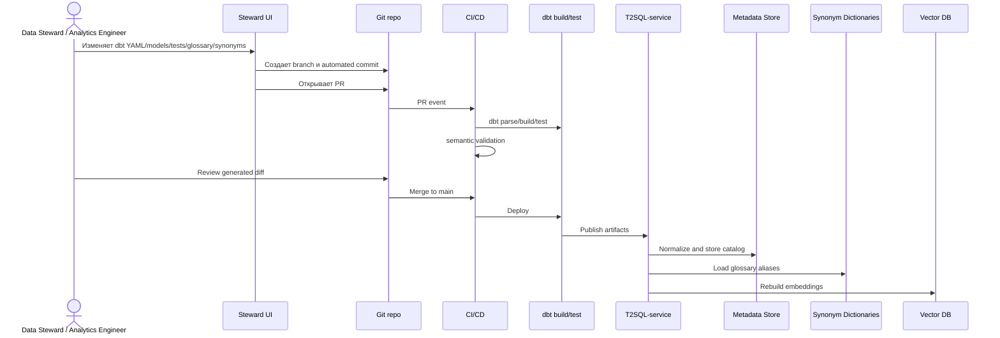
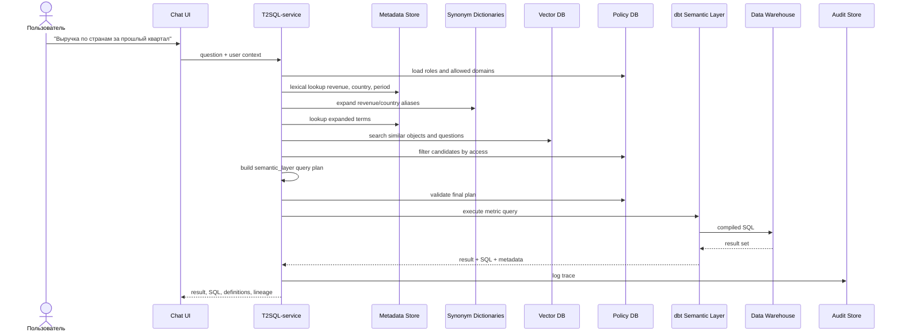
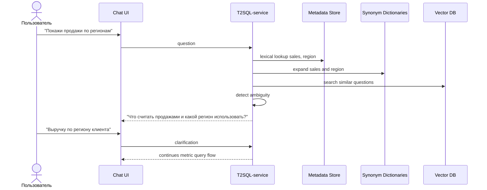
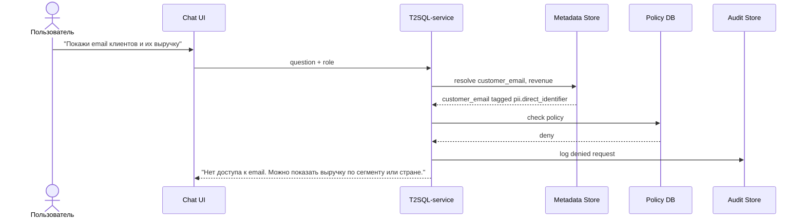
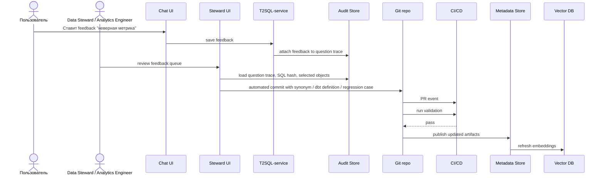
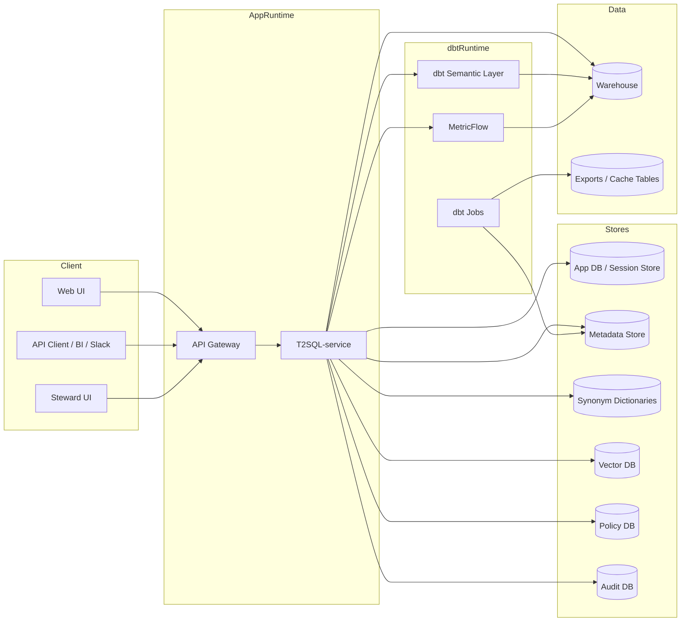

# Сценарии интеграции

Этот файл дополняет [основную спецификацию](../spec.md) и фиксирует последовательности взаимодействия T2SQL-service с внешними компонентами.

## Последовательность: настройка администратором

## Последовательность: публикация semantic changes

## Последовательность: успешный metric query

## Последовательность: неоднозначный вопрос

## Последовательность: отказ по policy

## Последовательность: feedback → улучшение семантики

## Deployment

