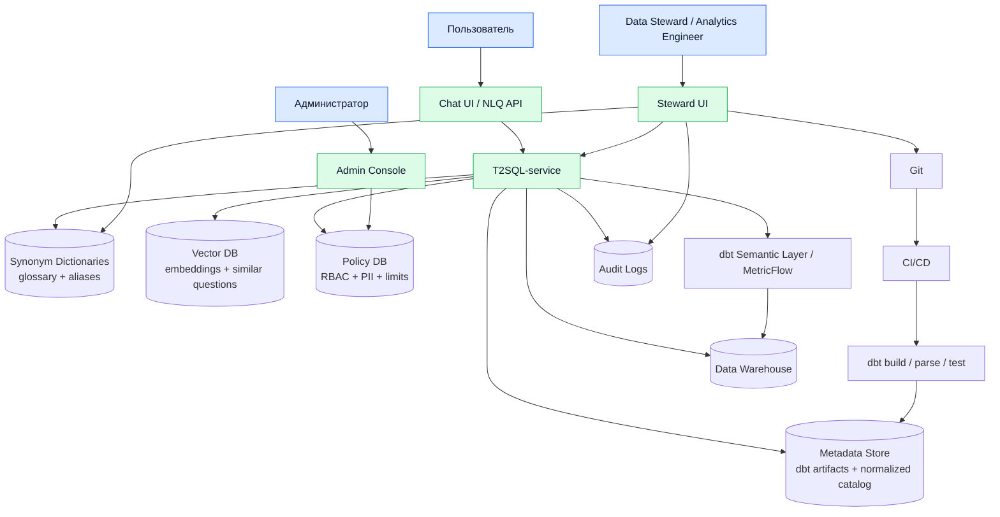
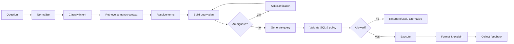
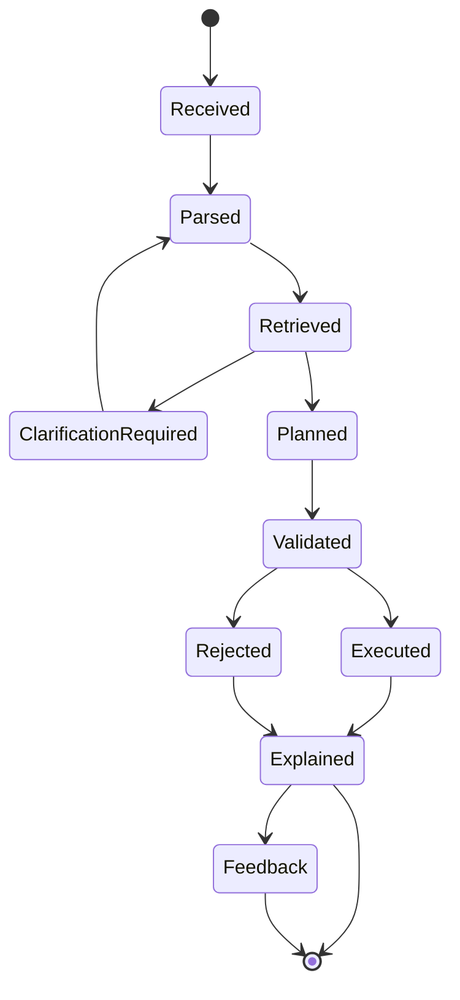

# Спецификация: [dbt Semantic Layer](https://docs.getdbt.com/docs/use-dbt-semantic-layer/dbt-sl) + Text-to-SQL

**Версия:** 0.3  
**Формат:** component spec  
**Фокус:** компоненты, роли, взаимодействия, последовательности выполнения NLQ → SQL

---

## Область системы

T2SQL-service принимает вопрос пользователя на естественном языке, сопоставляет его с dbt-семантикой и внешними справочниками, строит безопасный запрос, выполняет его в DWH или через dbt Semantic Layer и возвращает результат, SQL и краткое объяснение.

---

## Роли

| Роль | Что делает | Когда участвует |
|---|---|---|
| Администратор | Настраивает подключения, SSO, роли, лимиты, политики | setup, изменение доступов, incident/debug |
| Data steward / Analytics engineer | Управляет бизнес-терминами, синонимами, certified metrics и изменениями [dbt-моделей](https://docs.getdbt.com/docs/build/sql-models), [data tests](https://docs.getdbt.com/reference/resource-properties/data-tests), [контрактов](https://docs.getdbt.com/docs/mesh/govern/model-contracts), semantic YAML | добавление/уточнение семантики, разбор feedback, изменение модели данных и метрик |
| Пользователь | Задает вопросы к данным на натуральном языке | обычное использование |
| T2SQL-service | Парсит вопрос, строит план, применяет policy, генерирует/выполняет запрос | каждый пользовательский вопрос |

---

## Высокоуровневая архитектура



---

## Компоненты приложения

| Компонент | Назначение | Используется когда |
|---|---|---|
| Chat UI / NLQ API | Пользовательский и программный вход: вопрос, SQL preview, результат, feedback | пользовательский вопрос или внешний API-вызов |
| Steward UI | Control plane для data stewards / analytics engineers: glossary, synonyms, dbt YAML, semantic models, metrics, tests, contracts, review feedback, certification status | governance workflow, разбор feedback, автоматизированные git-коммиты/PR |
| T2SQL-service | Единственный прикладной сервис: auth context, normalization, retrieval, planning, generation, validation, execution, explain, feedback, audit | каждый пользовательский вопрос |
| Metadata Store | Нормализованный catalog из [dbt artifacts](https://docs.getdbt.com/reference/artifacts/dbt-artifacts), descriptions, lineage, certification, ownership | retrieval, planning, explain, CI validation |
| Synonym Dictionaries | Бизнес-глоссарий, алиасы, переводы, доменные термины | term resolution, disambiguation, explain |
| Vector DB | Embeddings для semantic objects, описаний, похожих вопросов и regression cases | semantic retrieval и ranking |
| Policy DB / Policy Engine | RBAC, PII tags, row/column policies, лимиты, allowlists | перед планированием, генерацией и исполнением |
| dbt Semantic Layer / [MetricFlow](https://docs.getdbt.com/docs/build/about-metricflow) | Каноническое исполнение metric queries поверх dbt-семантики | certified KPI, агрегаты, group by, time series |
| Data Warehouse | Фактическое хранилище данных и runtime для compiled SQL | выполнение compiled semantic query или controlled fallback SQL |
| Audit Store | Trace вопроса, decisions, policy checks, query plan, SQL hash, статус | каждый запрос и incident/debug |


## Steward workflow

`Steward Studio` в предыдущей версии документа был не отдельным runtime-сервисом, а рабочим местом data steward. Чтобы не путать его с `Admin Console`, в дизайне он фиксируется как `Steward UI`. Роль data steward объединяется с analytics engineer: один пользователь управляет бизнес-семантикой и dbt-файлами через UI, а изменения публикуются автоматизированными git-коммитами и PR.

### Что делает data steward

| Задача | Действие в UI | Результат |
|---|---|---|
| Разбор плохого ответа | Видит question trace, выбранные semantic objects, SQL hash, policy decisions, feedback comment | создает steward task или regression case |
| Управление glossary | Добавляет/редактирует business term, definition, owner, domain | обновляется Synonym Dictionaries и Metadata Store |
| Управление synonyms | Маппит пользовательские формулировки на canonical semantic object | T2SQL-service лучше resolve-ит термины |
| Изменение dbt semantics | Редактирует descriptions, semantic models, metrics, saved queries, tests, contracts | Steward UI создает branch, коммитит dbt YAML/SQL changes и открывает PR |
| Certification | Помечает metric/dimension/saved query как certified/experimental/deprecated | ranking в retrieval учитывает статус |
| Review изменений | Проверяет PR или draft-изменение перед публикацией | CI/CD валидирует dbt project, glossary, policies и regression questions |

### Варианты реализации

| Вариант | Когда выбирать | Как выглядит |
|---|---|---|
| Встроенный `Steward UI` в T2SQL-service | MVP, нет enterprise data catalog, нужен быстрый workflow для feedback, synonyms и dbt semantic changes | 4–6 экранов: feedback queue, semantic object detail, dbt semantic YAML editor, glossary editor, synonym editor, certification toggle. Изменения сохраняются как branch + commit + PR в dbt Git repo. |
| Third-party data catalog | В компании уже есть governance/catalog practice или нужен готовый workflow approval/ownership/asset tagging | T2SQL-service синхронизирует glossary terms, owners, domains, tags и descriptions через adapter. Кандидаты: [OpenMetadata Glossary](https://docs.open-metadata.org/latest/how-to-guides/data-governance/glossary) или [DataHub GlossaryTerm](https://docs.datahub.com/docs/generated/metamodel/entities/glossaryterm). |
| Git-only workflow | Команда хочет все semantic changes review-ить как код без UI-редактора | Steward UI показывает feedback и deep link на файлы, а пользователь правит `glossary.yml`, `synonyms.yml`, dbt YAML/SQL descriptions и regression questions напрямую в PR. |

Рекомендация для текущего дизайна: для MVP реализовать встроенный `Steward UI` как часть T2SQL-service, а интеграцию с data catalog оставить adapter boundary. Так T2SQL не зависит от конкретного vendor, но может заменить собственный glossary/synonym UI на OpenMetadata/DataHub, если они уже используются в организации.

---

## Компоненты semantic layer

| Компонент | Назначение | Используется когда |
|---|---|---|
| dbt models | Физические и логические витрины данных | источник данных для semantic objects |
| [dbt semantic models](https://docs.getdbt.com/docs/build/semantic-models) | Описание фактов, измерений, сущностей | при построении metric query |
| [dbt metrics](https://docs.getdbt.com/docs/build/metrics-overview) | Канонические KPI и формулы | когда вопрос содержит бизнес-метрику |
| [dbt entities](https://docs.getdbt.com/docs/build/entities) | Join keys между semantic models | при группировках и связях между сущностями |
| [dbt dimensions](https://docs.getdbt.com/docs/build/dimensions) | Доступные разрезы анализа, включая time dimensions и grain | при `by country`, `by segment`, `monthly` |
| [dbt saved queries](https://docs.getdbt.com/docs/build/saved-queries) | Сохраненные semantic-запросы | для типовых вопросов и certified outputs |
| [dbt exports](https://docs.getdbt.com/docs/use-dbt-semantic-layer/exports) | Материализованные saved queries | когда нужен cache, BI-совместимость или low latency |
| dbt data tests | Проверка качества данных | в CI/CD и как сигнал trust |
| dbt model contracts | Контракт колонок и типов | при validation Metadata Store |
| [dbt docs/descriptions](https://docs.getdbt.com/docs/build/documentation) | Описания моделей, колонок, метрик | для retrieval и explainability |
| [dbt exposures](https://docs.getdbt.com/docs/build/exposures) | Связь метрик/моделей с downstream BI | для lineage и impact analysis |
| dbt artifacts | `manifest.json`, `catalog.json`, semantic metadata | для наполнения Metadata Store и Vector DB |

---

## Хранилища и индексы T2SQL-service

| Хранилище | Что содержит | Как использует T2SQL-service |
|---|---|---|
| Metadata Store | Нормализованные dbt artifacts, semantic objects, descriptions, domains, ownership, certification, lineage | точный lookup по имени, domain filter, validation, explain |
| Synonym Dictionaries | Термины, синонимы, переводы, business definitions, canonical object refs | расширяет запрос пользователя и разрешает бизнес-термины |
| Vector DB | Embeddings для descriptions, semantic objects, saved queries, прошлых/регрессионных вопросов | ищет близкие объекты и похожие вопросы после lexical lookup |
| Policy DB | Роли, группы, row/column rules, PII tags, allowlists, cost limits | отсекает недоступные объекты до query generation и проверяет финальный query plan |
| Audit Store | Request trace, selected objects, policy decisions, SQL hash, latency, feedback | explainability, расследования, regression mining |

---

## Security controls

| Control | Где хранится / исполняется | Используется когда |
|---|---|---|
| SSO identity | Identity Provider + user context в T2SQL-service | login, API вызов |
| RBAC mapping | Policy DB, применяется T2SQL-service | каждый запрос |
| Semantic object access | Policy DB, применяется до ranking и query generation | перед планированием и исполнением |
| PII tags | Metadata Store + Policy DB | при artifact import, retrieval и validation |
| Column masking | Policy DB, применяется T2SQL-service или DWH policy layer | при row-level/drilldown запросах |
| Row-level rules | Policy DB, применяется T2SQL-service или DWH policy layer | перед исполнением |
| Cost limits | Policy DB, проверяется T2SQL-service | перед исполнением |
| SQL AST validation | T2SQL-service | перед fallback SQL execution |
| Read-only warehouse role | Data Warehouse | runtime execution |
| Audit trail | Audit Store | всегда |

---

## Компоненты T2SQL pipeline

| Этап | Вход | Выход | Где выполняется |
|---|---|---|---|
| Normalize | текст вопроса | нормализованный текст, даты, язык | T2SQL-service |
| Classify | нормализованный текст | intent type | T2SQL-service |
| Retrieve | intent + текст | candidate semantic objects | T2SQL-service + Metadata Store + Synonym Dictionaries + Vector DB |
| Resolve | candidates | canonical metrics/dimensions/entities | T2SQL-service |
| Plan | resolved objects | query plan | T2SQL-service |
| Clarify | low confidence plan | уточняющий вопрос | T2SQL-service |
| Generate | query plan | semantic query или SQL | T2SQL-service |
| Validate | generated query | allow/deny/warn | T2SQL-service + Policy DB |
| Execute | validated query | result set | T2SQL-service + dbt Semantic Layer / MetricFlow / DWH |
| Explain | result + metadata | answer payload | T2SQL-service |
| Learn | feedback | steward task / regression case | T2SQL-service + Audit Store |



---

## Алгоритм обработки вопроса в T2SQL-service

Для реализации T2SQL-service важно зафиксировать не только pipeline, но и порядок обращения к внешним хранилищам:

1. T2SQL-service принимает `question + user context`, восстанавливает session context и получает роли/группы пользователя.
2. Нормализует текст: язык, даты, валюты, числовые выражения, timezone, domain hint.
3. Делает первичную policy-проверку в Policy DB: доступные домены, запрет PII/direct identifiers, лимиты периода и строк.
4. Выполняет lexical lookup в Metadata Store: ищет точные совпадения по metric/dimension/entity/saved query names, labels, descriptions и domain.
5. Расширяет запрос через Synonym Dictionaries: заменяет пользовательские термины на canonical terms, добавляет переводы и доменные алиасы.
6. Повторяет lookup в Metadata Store уже по расширенному набору терминов и собирает кандидатов с lineage, certification и ownership.
7. Запрашивает Vector DB: ищет близкие semantic objects, saved queries, прошлые подтвержденные вопросы и regression cases.
8. Ранжирует кандидатов: точные совпадения выше vector-only, certified выше experimental, объекты вне policy scope исключаются, deprecated понижается.
9. Разрешает термины в canonical semantic objects: metrics, dimensions, entities, filters, time dimension, grain, saved query.
10. Проверяет неоднозначность: если несколько метрик или dimensions имеют близкий score, возвращает уточняющий вопрос вместо генерации SQL.
11. Строит query plan с `execution_mode`: `saved_query`, `semantic_layer`, `export_cache`, `fallback_sql` или `unsupported`.
12. Для `semantic_layer` формирует metric query для dbt Semantic Layer / MetricFlow; для `fallback_sql` генерирует controlled SQL только по allowlisted dbt models.
13. Валидирует query plan и SQL: только `SELECT`, разрешенные таблицы/колонки, join path через dbt entities, обязательный `limit`, cost/timeout, row/column policies.
14. Выполняет запрос через dbt Semantic Layer / MetricFlow или read-only DWH role.
15. Формирует ответ: result table, SQL, metric definitions, filters, period, warnings, lineage и confidence.
16. Записывает audit event: normalized question, selected semantic objects, policy decisions, query plan, SQL hash, latency, status.
17. При feedback сохраняет связку `question → expected objects/result issue` как задачу data steward и потенциальный regression case.

---

## Режимы исполнения

| Режим | Когда используется | Как выполняется |
|---|---|---|
| `semantic_layer` | KPI, агрегаты, group by, time series | через dbt Semantic Layer / MetricFlow |
| `saved_query` | вопрос совпал с curated query | через dbt saved query / export |
| `export_cache` | есть материализованный результат | чтение из export/cache table |
| `fallback_sql` | разрешенный row-level/drilldown вопрос | controlled SQL по allowlisted dbt models |
| `unsupported` | нет семантики, нет прав, опасный запрос | отказ или уточнение |

---

## Внутренний query plan

```json
{
  "query_type": "metric_query",
  "metrics": ["revenue"],
  "dimensions": ["customer__country"],
  "time_range": {
    "dimension": "order_date",
    "start": "2026-01-01",
    "end": "2026-03-31",
    "grain": "quarter"
  },
  "filters": [],
  "sort": [{"field": "revenue", "direction": "desc"}],
  "limit": 100,
  "execution_mode": "semantic_layer",
  "confidence": 0.91,
  "requires_clarification": false
}
```

---

## Формат semantic object

```yaml
id: metric.revenue
type: metric
name: revenue
label: Revenue
description: Net revenue after discounts, before refunds.
domain: finance
owner: finance_analytics
certification: certified
sensitivity: internal
dbt_node_id: metric.project.revenue
synonyms:
  - sales
  - turnover
  - net sales
  - выручка
allowed_dimensions:
  - order_date
  - customer__country
  - product__category
lineage:
  - semantic_model.orders
  - model.fct_orders
```

---

## Валидация SQL

| Проверка | Правило |
|---|---|
| Statement type | только `SELECT` |
| Tables | только allowlisted dbt models / semantic outputs |
| Columns | только разрешенные columns |
| Joins | только разрешенные relationships |
| Limit | обязателен для fallback SQL |
| PII | deny/mask/aggregate-only |
| Cost | timeout, max rows, max scanned bytes |
| Comments/chaining | semicolon chaining запрещен |
| Functions | только allowlisted functions |
| Warehouse role | read-only |

---

## Состояния запроса



---

## CI/CD checks

| Check | Когда | Что проверяет |
|---|---|---|
| [`dbt parse`](https://docs.getdbt.com/reference/commands/parse) | PR | валидность dbt project |
| [`dbt build`](https://docs.getdbt.com/reference/commands/build) | PR/deploy | модели, tests, contracts |
| semantic validation | PR/deploy | метрики, dimensions, saved queries |
| glossary validation | PR | canonical object exists |
| policy validation | PR | роли и sensitivity tags валидны |
| T2SQL regression | PR/deploy | вопросы маппятся в ожидаемые semantic objects |
| artifact publish | deploy | новые artifacts доступны Metadata Store и Vector DB |

---

## Минимальный MVP

| Блок | Минимум |
|---|---|
| dbt coverage | 1 домен, 5–10 метрик, 10–30 dimensions |
| Metadata Store / Vector DB / Synonym Dictionaries | import artifacts, search, glossary, synonyms |
| T2SQL-service | intent, retrieval, planner, semantic query generation |
| Execution | dbt SL / MetricFlow adapter |
| Security | SSO, RBAC, PII deny/mask, audit |
| UI | вопрос, результат, SQL, explanation, feedback |
| Quality | 30–50 regression questions |

---

## Критерии готовности

- dbt artifacts импортируются после deploy;
- semantic objects доступны T2SQL-service через Metadata Store;
- вопросы по certified metrics идут через dbt Semantic Layer / MetricFlow;
- fallback SQL ограничен allowlist и проходит AST validation;
- T2SQL-service и Policy DB блокируют PII и недоступные домены;
- пользователь видит результат, SQL, definitions, warnings;
- feedback попадает data steward;
- есть audit trail по каждому запросу;
- regression suite запускается в CI/CD.
