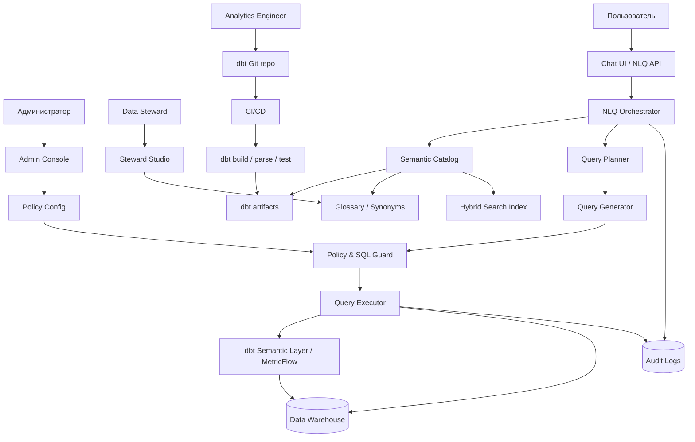
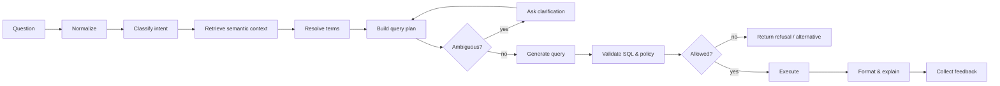
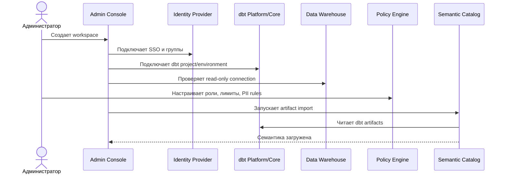
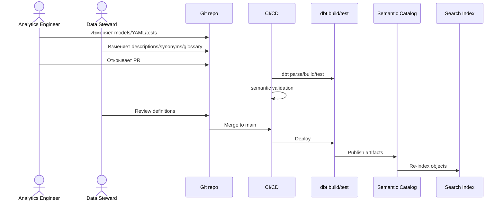
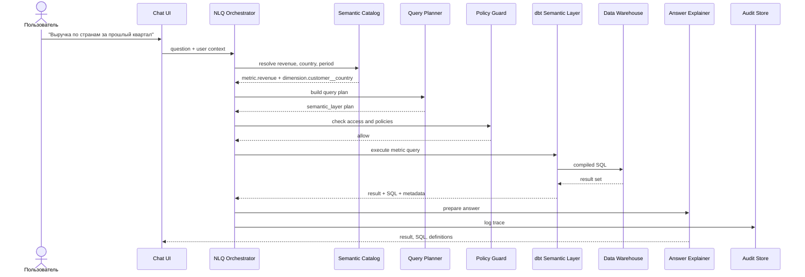
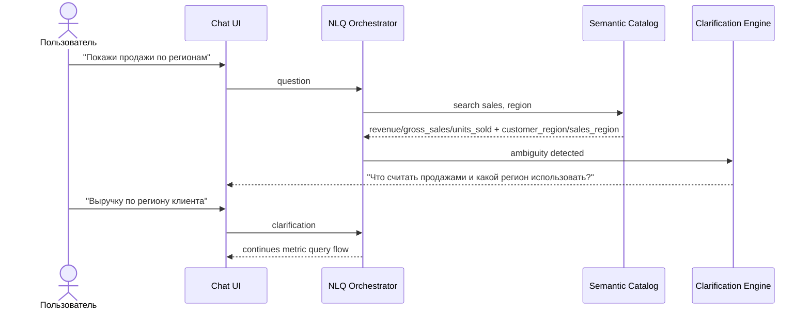
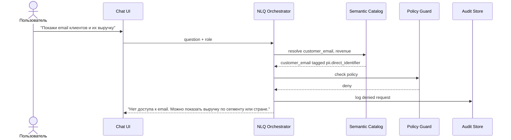
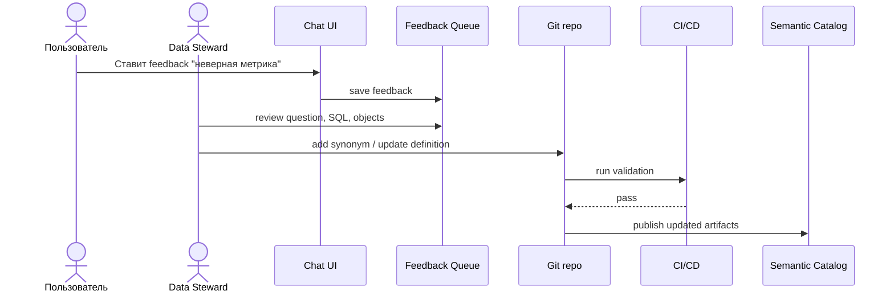
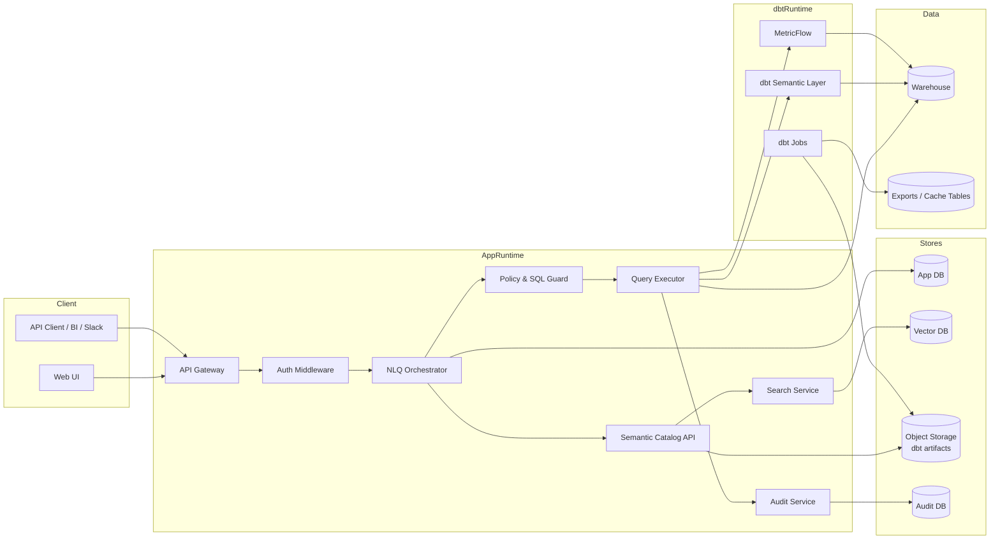
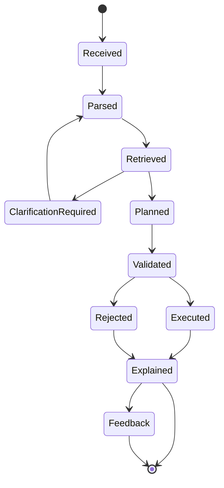

# Спецификация: dbt Semantic Layer + Text-to-SQL

**Версия:** 0.2  
**Формат:** component spec  
**Фокус:** компоненты, роли, взаимодействия, последовательности выполнения NLQ → SQL

---

## 1. Область системы

Система принимает вопрос пользователя на естественном языке, сопоставляет его с dbt-семантикой, строит безопасный запрос, выполняет его в DWH и возвращает результат, SQL и краткое объяснение.

---

## 2. Роли

| Роль | Что делает | Когда участвует |
|---|---|---|
| Администратор | Настраивает подключения, SSO, роли, лимиты, политики | setup, изменение доступов, incident/debug |
| Data steward | Управляет бизнес-терминами, синонимами, certified metrics | добавление/уточнение семантики, разбор feedback |
| Analytics engineer | Развивает dbt-модели, тесты, контракты, semantic YAML | изменение модели данных и метрик |
| Пользователь | Задает вопросы к данным на натуральном языке | обычное использование |
| T2SQL service | Парсит вопрос, строит план, генерирует/выполняет запрос | каждый пользовательский вопрос |

---

## 3. Высокоуровневая архитектура



---

## 4. Компоненты приложения

| Компонент | Назначение | Используется когда |
|---|---|---|
| Chat UI | Интерфейс вопрос-ответ, SQL preview, результат, feedback | пользователь задает вопрос |
| NLQ API | HTTP/API вход для UI, BI, Slack, внутренних клиентов | любой внешний вызов |
| Auth Middleware | Проверяет пользователя, группы, tenant, роли | каждый запрос |
| NLQ Orchestrator | Управляет pipeline NLQ → result | каждый вопрос |
| Language Normalizer | Определяет язык, нормализует даты, числа, валюты | перед intent parsing |
| Intent Classifier | Определяет тип запроса: metric, lookup, drilldown, unsupported | после нормализации |
| Semantic Retriever | Достает релевантные метрики, dimensions, entities, saved queries | после intent classification |
| Term Resolver | Маппит слова пользователя на canonical semantic objects | при разборе вопроса |
| Query Planner | Строит формальный query plan | перед генерацией SQL |
| Clarification Engine | Формирует уточняющий вопрос | если confidence низкий или есть неоднозначность |
| Query Generator | Генерирует semantic query или controlled SQL | после query plan |
| SQL Validator | Проверяет SQL AST, только SELECT, лимиты, allowlist | перед исполнением SQL |
| Policy Guard | Проверяет RBAC, PII, row/column policies, cost limits | перед исполнением |
| Query Executor | Выполняет запрос через dbt SL, MetricFlow или DWH | после validation |
| Result Formatter | Форматирует таблицу, типы, значения, агрегаты | после получения result set |
| Answer Explainer | Объясняет метрики, фильтры, период, SQL, lineage | перед ответом пользователю |
| Feedback Collector | Сохраняет оценки и комментарии пользователя | после ответа |
| Audit Logger | Логирует вопрос, план, SQL hash, объекты, статус | на каждом этапе |
| Session Store | Хранит thread context и уточнения | в многошаговом диалоге |

---

## 5. Компоненты semantic layer

| Компонент | Назначение | Используется когда |
|---|---|---|
| dbt models | Физические и логические витрины данных | источник данных для semantic objects |
| dbt semantic models | Описание фактов, измерений, сущностей | при построении metric query |
| dbt metrics | Канонические KPI и формулы | когда вопрос содержит бизнес-метрику |
| dbt entities | Join keys между semantic models | при группировках и связях между сущностями |
| dbt dimensions | Доступные разрезы анализа | при `by country`, `by segment`, `monthly` |
| dbt time dimensions | Временные поля и grain | при периодах, трендах, сравнениях |
| dbt saved queries | Сохраненные semantic-запросы | для типовых вопросов и certified outputs |
| dbt exports | Материализованные saved queries | когда нужен cache, BI-совместимость или low latency |
| dbt tests | Проверка качества данных | в CI/CD и как сигнал trust |
| dbt contracts | Контракт колонок и типов | при validation semantic catalog |
| dbt docs/descriptions | Описания моделей, колонок, метрик | для retrieval и explainability |
| dbt exposures | Связь метрик/моделей с downstream BI | для lineage и impact analysis |
| dbt artifacts | `manifest.json`, `catalog.json`, semantic metadata | для индексации semantic catalog |

---

## 6. Компоненты metadata/catalog

| Компонент | Назначение | Используется когда |
|---|---|---|
| Semantic Catalog API | Единый API по метрикам, dimensions, entities, lineage | при retrieval, planner, explain |
| Artifact Importer | Загружает dbt artifacts из CI/CD или object storage | после каждого deploy |
| Metadata Normalizer | Приводит dbt metadata к внутренней схеме | после artifact import |
| Hybrid Search Index | Поиск по names, descriptions, synonyms, embeddings | при сопоставлении вопроса с семантикой |
| Glossary Store | Бизнес-термины и определения | при term resolution и explain |
| Synonym Store | Алиасы терминов на разных языках | при natural language matching |
| Certification Registry | Статус certified/experimental/deprecated | при ранжировании объектов |
| Lineage Service | Связь metric → semantic model → dbt model → source | в explain, audit, impact analysis |
| Domain Registry | Финансы, продажи, продукт и другие домены | при сужении search space |
| Ownership Registry | Владельцы объектов | для governance и feedback routing |

---

## 7. Компоненты безопасности

| Компонент | Назначение | Используется когда |
|---|---|---|
| Identity Provider | SSO, группы, пользовательские атрибуты | login, API вызов |
| RBAC Mapper | Маппит IdP groups в роли системы | каждый запрос |
| Policy Engine | Применяет правила доступа к semantic objects | перед планированием и исполнением |
| PII Classifier | Определяет sensitivity tags колонок/метрик | при catalog import и validation |
| Column Masking Rules | Маскирует email/phone/id и другие поля | при row-level/drilldown запросах |
| Row-Level Rules | Ограничивает строки по региону, tenant, org unit | перед исполнением |
| Cost Guard | Проверяет estimated cost, лимиты строк, timeout | перед исполнением |
| SQL AST Guard | Блокирует опасный SQL | перед fallback SQL execution |
| Warehouse Read-only Role | Выполняет только SELECT | runtime execution |
| Audit Store | Хранит trace действий и решений | всегда |

---

## 8. Компоненты T2SQL pipeline

| Этап | Вход | Выход | Компоненты |
|---|---|---|---|
| Normalize | текст вопроса | нормализованный текст, даты, язык | Language Normalizer |
| Classify | нормализованный текст | intent type | Intent Classifier |
| Retrieve | intent + текст | candidate semantic objects | Semantic Retriever, Search Index |
| Resolve | candidates | canonical metrics/dimensions/entities | Term Resolver |
| Plan | resolved objects | query plan | Query Planner |
| Clarify | low confidence plan | уточняющий вопрос | Clarification Engine |
| Generate | query plan | semantic query или SQL | Query Generator |
| Validate | generated query | allow/deny/warn | SQL Validator, Policy Guard |
| Execute | validated query | result set | Query Executor |
| Explain | result + metadata | answer payload | Answer Explainer |
| Learn | feedback | steward task / regression case | Feedback Collector |



---

## 9. Режимы исполнения

| Режим | Когда используется | Как выполняется |
|---|---|---|
| `semantic_layer` | KPI, агрегаты, group by, time series | через dbt Semantic Layer / MetricFlow |
| `saved_query` | вопрос совпал с curated query | через dbt saved query/export |
| `export_cache` | есть материализованный результат | чтение из export/cache table |
| `fallback_sql` | разрешенный row-level/drilldown вопрос | controlled SQL по allowlisted dbt models |
| `unsupported` | нет семантики, нет прав, опасный запрос | отказ или уточнение |

---

## 10. Внутренний query plan

```json
{
  "query_type": "metric_query",
  "metrics": ["revenue"],
  "dimensions": ["customer__country"],
  "time_range": {
    "dimension": "order_date",
    "start": "2026-01-01",
    "end": "2026-03-31",
    "grain": "quarter"
  },
  "filters": [],
  "sort": [{"field": "revenue", "direction": "desc"}],
  "limit": 100,
  "execution_mode": "semantic_layer",
  "confidence": 0.91,
  "requires_clarification": false
}
```

---

## 11. Формат semantic object

```yaml
id: metric.revenue
type: metric
name: revenue
label: Revenue
description: Net revenue after discounts, before refunds.
domain: finance
owner: finance_analytics
certification: certified
sensitivity: internal
dbt_node_id: metric.project.revenue
synonyms:
  - sales
  - turnover
  - net sales
  - выручка
allowed_dimensions:
  - order_date
  - customer__country
  - product__category
lineage:
  - semantic_model.orders
  - model.fct_orders
```

---

## 12. dbt project layout

```text
dbt_project/
  models/
    staging/
      sources.yml
      stg_orders.sql
      stg_customers.sql
      stg_products.sql

    marts/
      finance/
        fct_orders.sql
        dim_customers.sql
        dim_products.sql
        orders.yml
        customers.yml
        metrics.yml
        saved_queries.yml

  macros/
    security/
      mask_email.sql
      apply_region_filter.sql

  semantic/
    glossary.yml
    synonyms.yml
    t2sql_policies.yml
    regression_questions.yml
```

---

## 13. Пример dbt semantic YAML

```yaml
version: 2

models:
  - name: fct_orders
    description: "One row per order line."
    config:
      group: finance
      access: public
      contract:
        enforced: true
      meta:
        domain: finance
        owner: finance_analytics

    columns:
      - name: order_id
        data_type: string
        data_tests: [not_null]

      - name: customer_id
        data_type: string
        data_tests:
          - not_null
          - relationships:
              to: ref('dim_customers')
              field: customer_id

      - name: order_date
        data_type: date

      - name: net_revenue
        data_type: numeric

    semantic_model:
      name: orders
      defaults:
        agg_time_dimension: order_date

      entities:
        - name: order
          type: primary
          expr: order_id

        - name: customer
          type: foreign
          expr: customer_id

      dimensions:
        - name: order_date
          type: time
          expr: order_date
          type_params:
            time_granularity: day

        - name: order_status
          type: categorical
          expr: status

metrics:
  - name: revenue
    label: Revenue
    description: "Net revenue after discounts, before refunds."
    type: simple
    type_params:
      measure: net_revenue
    config:
      meta:
        domain: finance
        owner: finance_analytics
        certified: true
        synonyms:
          - sales
          - turnover
          - выручка

  - name: average_order_value
    label: Average Order Value
    type: ratio
    type_params:
      numerator: revenue
      denominator: orders
```

---

## 14. Glossary и synonyms

```yaml
business_terms:
  - term: revenue
    canonical_object: metric.revenue
    definition: Net revenue after discounts, before refunds.
    owner: finance_analytics
    certified: true

synonyms:
  revenue:
    - sales
    - turnover
    - net sales
    - выручка
    - продажи

  customer__country:
    - country
    - client country
    - страна клиента
```

Используется при semantic retrieval, disambiguation и объяснении результата.

---

## 15. Policies

```yaml
defaults:
  allow_write_sql: false
  allow_raw_sources: false
  require_limit: true
  max_rows: 1000
  timeout_seconds: 60

roles:
  viewer:
    allowed_domains: [finance, sales]
    denied_tags: [pii, restricted]
    max_date_range_days: 730

  finance_analyst:
    allowed_domains: [finance]
    denied_tags: [direct_identifier]
    max_date_range_days: 3650

pii:
  email:
    action: mask
  phone:
    action: mask
  direct_identifier:
    action: deny
```

Используется перед построением финального SQL и перед исполнением.

---

## 16. Последовательность: настройка администратором



---

## 17. Последовательность: публикация semantic changes



---

## 18. Последовательность: успешный metric query



---

## 19. Последовательность: неоднозначный вопрос



---

## 20. Последовательность: отказ по policy



---

## 21. Последовательность: feedback → улучшение семантики



---

## 22. Deployment



---

## 23. API

### `POST /v1/questions`

```json
{
  "text": "Покажи выручку по странам за прошлый квартал",
  "domain": "finance",
  "session_id": "s_123",
  "options": {
    "show_sql": true,
    "max_rows": 100
  }
}
```

Response:

```json
{
  "question_id": "q_123",
  "status": "succeeded",
  "execution_mode": "semantic_layer",
  "data": [
    {"country": "Germany", "revenue": 1200000}
  ],
  "sql": "select ...",
  "semantic_objects": [
    {"type": "metric", "name": "revenue", "certified": true},
    {"type": "dimension", "name": "customer__country"}
  ],
  "explanation": {
    "metric": "Revenue = net revenue after discounts, before refunds.",
    "period": "previous quarter",
    "lineage": ["fct_orders", "dim_customers"]
  },
  "warnings": []
}
```

### `POST /v1/feedback`

```json
{
  "question_id": "q_123",
  "rating": "incorrect",
  "comment": "GMV был интерпретирован как revenue."
}
```

---

## 24. Валидация SQL

| Проверка | Правило |
|---|---|
| Statement type | только `SELECT` |
| Tables | только allowlisted dbt models / semantic outputs |
| Columns | только разрешенные columns |
| Joins | только разрешенные relationships |
| Limit | обязателен для fallback SQL |
| PII | deny/mask/aggregate-only |
| Cost | timeout, max rows, max scanned bytes |
| Comments/chaining | semicolon chaining запрещен |
| Functions | только allowlisted functions |
| Warehouse role | read-only |

---

## 25. Состояния запроса



---

## 26. Audit event

```json
{
  "event": "query_executed",
  "question_id": "q_123",
  "user_id": "u_123",
  "role": "finance_analyst",
  "semantic_version": "git_sha:abc123",
  "execution_mode": "semantic_layer",
  "semantic_objects": ["metric.revenue", "dimension.customer__country"],
  "sql_hash": "sha256:...",
  "row_count": 42,
  "latency_ms": 1840,
  "status": "succeeded",
  "created_at": "2026-06-14T12:00:00Z"
}
```

---

## 27. CI/CD checks

| Check | Когда | Что проверяет |
|---|---|---|
| `dbt parse` | PR | валидность dbt project |
| `dbt build` | PR/deploy | модели, tests, contracts |
| semantic validation | PR/deploy | метрики, dimensions, saved queries |
| glossary validation | PR | canonical object exists |
| policy validation | PR | роли и sensitivity tags валидны |
| T2SQL regression | PR/deploy | вопросы маппятся в ожидаемые semantic objects |
| artifact publish | deploy | новые artifacts доступны catalog |

---

## 28. Regression question

```yaml
id: revenue_by_country_previous_quarter
text: "Покажи выручку по странам за прошлый квартал"
expected:
  execution_mode: semantic_layer
  metrics:
    - revenue
  dimensions:
    - customer__country
  forbidden_columns:
    - customer_email
  require_certified_metric: true
```

---

## 29. Минимальный MVP

| Блок | Минимум |
|---|---|
| dbt coverage | 1 домен, 5–10 метрик, 10–30 dimensions |
| Semantic Catalog | import artifacts, search, glossary, synonyms |
| T2SQL | intent, retrieval, planner, semantic query generation |
| Execution | dbt SL / MetricFlow adapter |
| Security | SSO, RBAC, PII deny/mask, audit |
| UI | вопрос, результат, SQL, explanation, feedback |
| Quality | 30–50 regression questions |

---

## 30. Критерии готовности

- dbt artifacts импортируются после deploy;
- semantic objects доступны через catalog API;
- вопросы по certified metrics идут через dbt Semantic Layer / MetricFlow;
- fallback SQL ограничен allowlist и проходит AST validation;
- policy guard блокирует PII и недоступные домены;
- пользователь видит результат, SQL, definitions, warnings;
- feedback попадает data steward;
- есть audit trail по каждому запросу;
- regression suite запускается в CI/CD.
